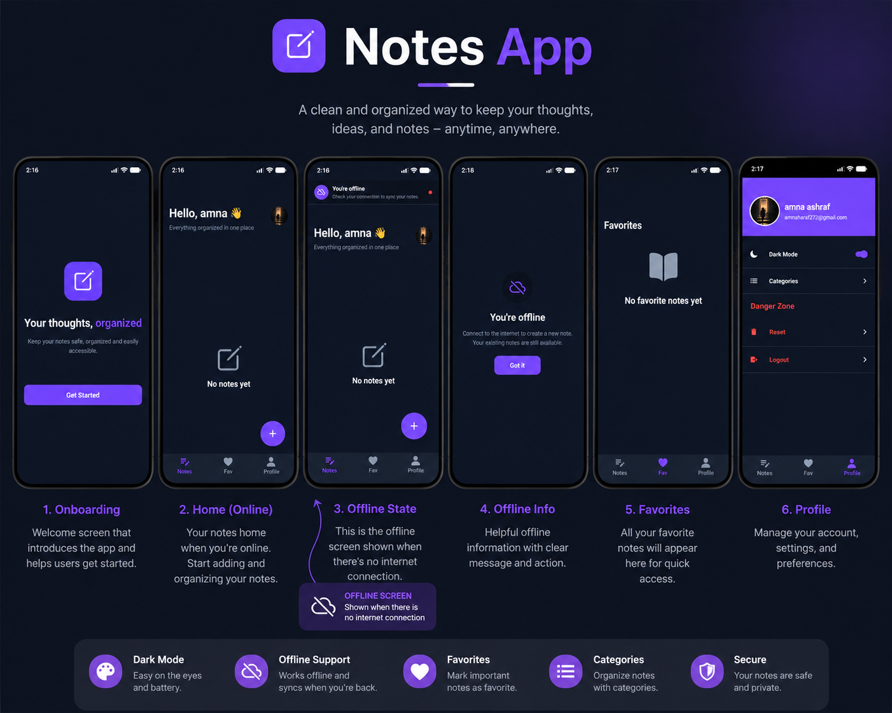

# Notes-App 📓

A mobile notes app built with Expo, React Native, Clerk, and Convex.

## 📱 Download APK

Want to try the Book Store App on Android?

👉 **[Download the latest APK](https://expo.dev/accounts/devamna/projects/Notes-App/builds/39945e48-8a8b-4d98-b95b-d1cecf73caab)**

> **Note:** This APK is for Android devices. You may need to allow installation from unknown sources when installing it.

## 📱 App Preview

## Features

- Google sign-in with Clerk
- Create, edit, delete, pin, and favorite notes
- Search and filter notes by category
- Upload images to notes
- Voice notes (record, play, and manage audio notes)
- Light and dark theme
- Profile screen with logout and reset
- Internet connection status detection with NetInfo

## Tech Stack

- Expo SDK 54
- React Native
- TypeScript
- Expo Router
- Clerk
- Convex

- @react-native-community/netinfo — used to check internet connectivity and detect offline status